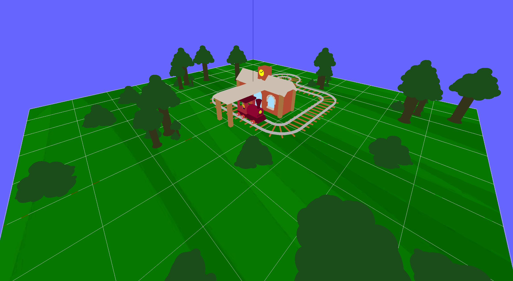
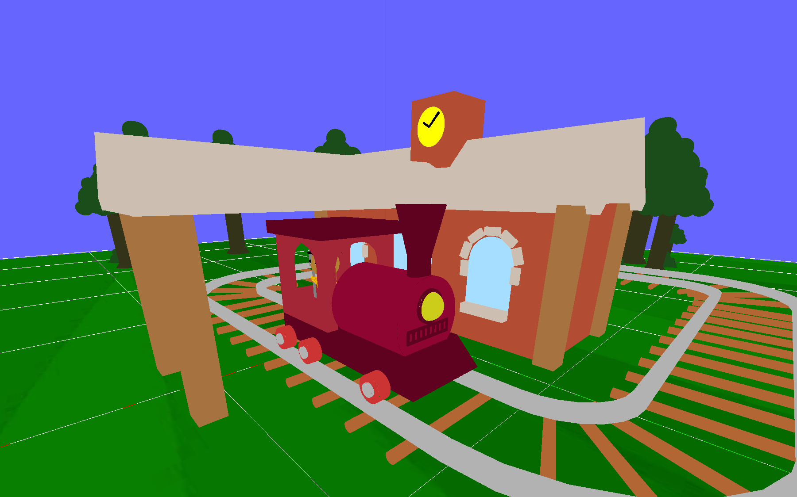
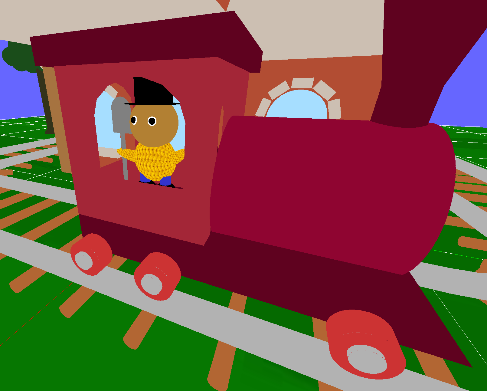
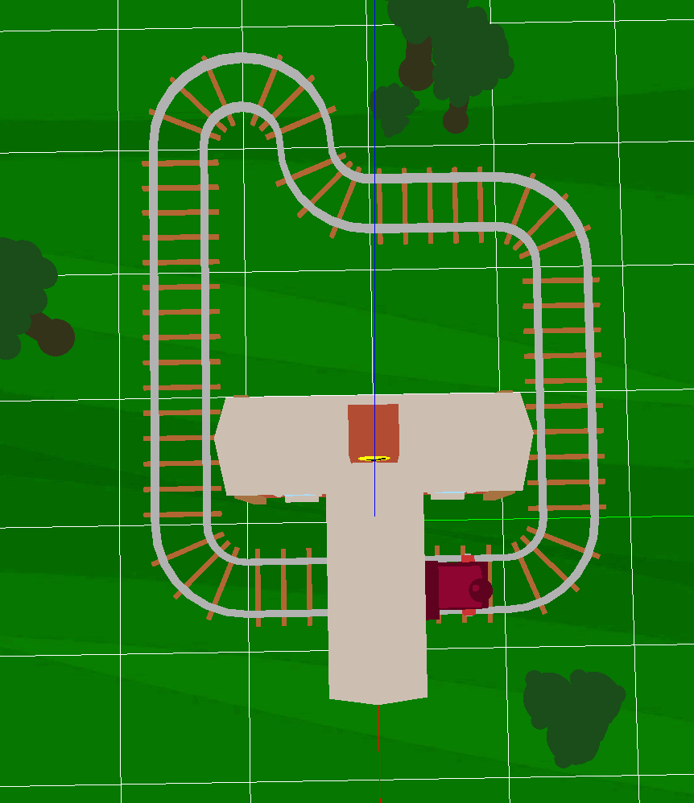
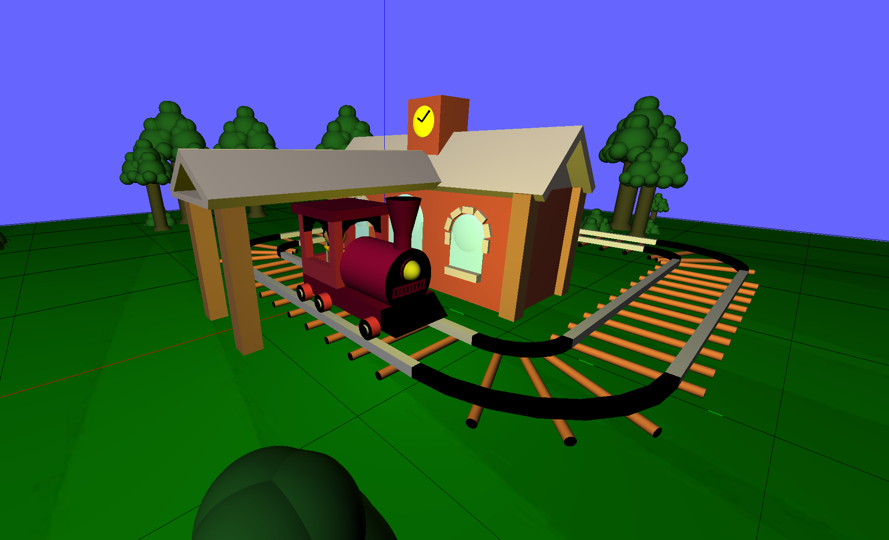
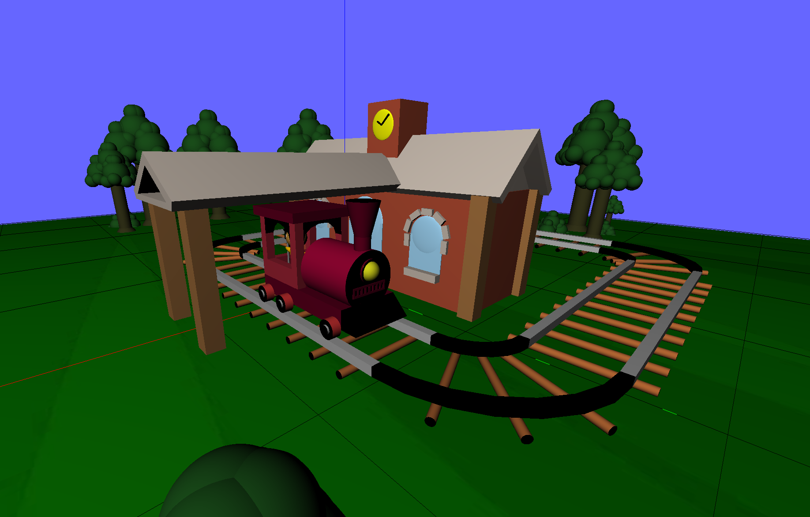
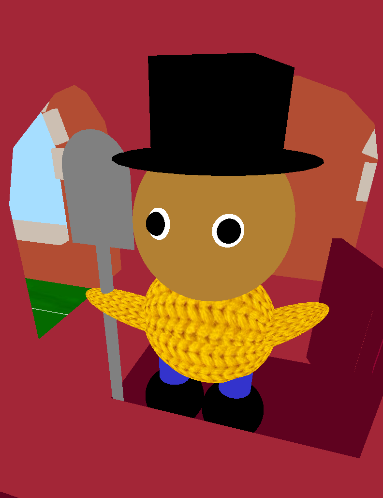

# Petit train en bois

Projet de synthèse d'image - Alexandre BONNET & Corentin ALBERT

Inspiré de jouets pour enfants.

[Lien Github](https://github.com/alexandre-bonnet/Petit-Train-En-Bois)

## Mode d'installation

Le projet est dans le répertoire **TD07** du projet (sauf le JSON, dans `assets/`). Le fichier main est **`ex01.cpp`**.

**!! Si vous êtes sur Mac !!**, il faut aller dans le fichier `ex01.cpp`, ligne 102, et dé-commenter ces lignes :

```cpp
glfwWindowHint(GLFW_CONTEXT_VERSION_MAJOR, 4);
glfwWindowHint(GLFW_CONTEXT_VERSION_MINOR, 1);
glfwWindowHint(GLFW_OPENGL_PROFILE, GLFW_OPENGL_CORE_PROFILE);
glfwWindowHint(GLFW_OPENGL_FORWARD_COMPAT, GL_TRUE);
```

### Lancer l'extension VSCode CMAKE

Compiler et exécuter le projet **`TD07_ex01`** dans la liste proposée.

### Lancer juste avec des commandes

**Sur mac / linux**

```shell
cmake -S . -B build
cmake --build build
cd bin
./TD07_ex01
```

**Sur windows**

```shell
cmake -S . -B build
cmake --build build --config Debug
cd bin
.\TD07_ex01.exe
```

## Commandes utilisateurs

`I`, `O` pour zoomer / dé-zoomer

Les flèches pour tourner autour de la scène

`J`, `K` pour activer / désactiver le mode réaliste (pour les lumières)

`Y`, `U` pour allumer / éteindre la lumière du train

`L`, `P` pour activer / désactiver la visualisation des arêtes

`Q` pour quitter

## Résultats obtenus

### Modélisation

Nous avons modélisé les rails et fait un parcours, modélisé un train avec un bonhomme dessus, et modélisé une gare. Il y a aussi des arbres et buissons sur la scène.






### Animation

Le bras du bonhomme est animé ! Il fait coucou aux personnes à quai.

### Illumination

Il y a aussi un mode avec les lumières réalistes. Le soleil imité est un soleil de fin de journée.



L'avant du train (la boule jaune) est illuminé. On peut activer / désactiver cette lumière. L'image précédente avait la lumière allumée, et voici avec la lumière éteinte :



### Textures

Il y a deux textures dans notre projet : le pull du bonhomme et le sol (voir les images précédentes pour le sol).



### Prise en compte du JSON

Les rails et la gare sont placés en fonction du JSON donné. Par défaut : `assets/railPlacement.json`. On peut modifier les placements dans le JSON, ou en donner un autre dans `draw_scene.cpp`, ligne 109.

## Détails techniques

Pour les rails courbes, nous avons créé deux 8 formes convexes 2d, 4 pour le rail interieur, 4 pour le rail exterieur.
Ils sont construits avec une boucle et on peut augmenter leur résolution en augmentant num. Ces Shapes n'ont pas d'information normale et sont donc noires quand la lumière est activée (idem pour les arches qui tiennent le toit)
Pour les dessiner, on input toutes les combinaisons possibles de rail en regardant les rail d'avant et d'après pour choisir l'orientation des rails.

Pour éviter toute duplication de code, nous avons créé des 'formes élémentaires' comme 'ClosedCylinder', un cylindre avec 2 cercles aux extrémités, ou 'BushySphere' pour dessiner les arbres et les buissons